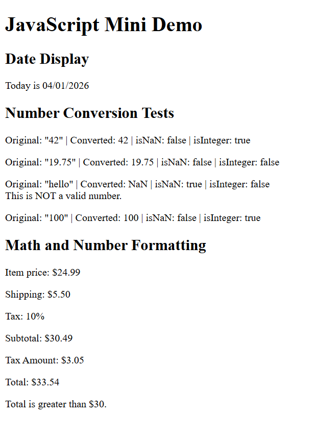

1. Objects and Methods
   - new Date()
   - getMonth()
   - getDate()
   - getFullYear()
   - Number()
   - Number.inNaN()
   - Number.isInteger()
   - padStart()
   - toFixed()
   - toLocaleString()
2. https://seanc0313.github.io/Comp-484-HW9/
3. 
4. What part was easiest?
   - The easiest part was displaying the result onto the webpage itself using their IDs
   What part was hardest?
   - The hardest part was making sure every value was converted and checked using the methods like Number.isNaN()
   What did you learn about the `Date` object?
   - I learned that the Date object can be used to get the current date, but the moth has to be adjusted cause it starts at 0.
   What did you learn about the `Number` object?
   - I learned that Number object can be used for converting strings into numbers and checking if values are valid integers.
   What did you learn about displaying results in the browser?
   - I learned the by using IDs, you can easily display the results in the browswer by linking the variables to the ID.
